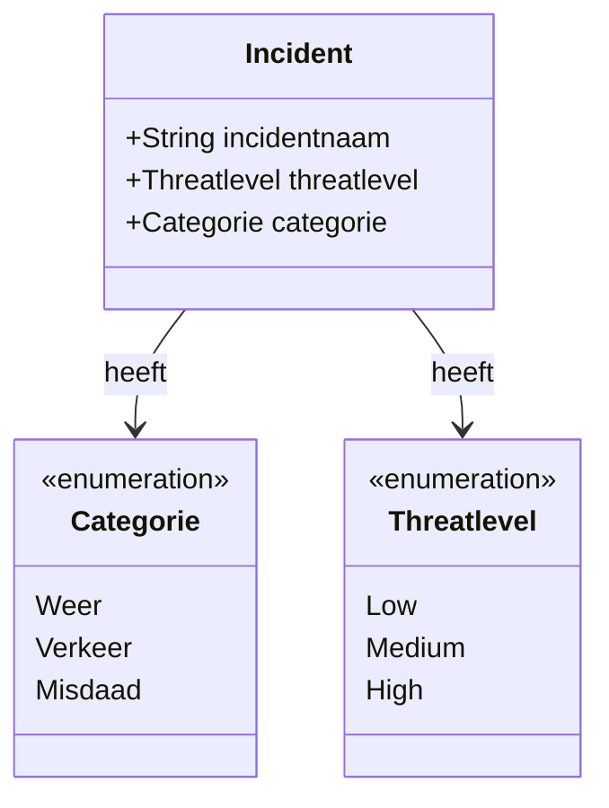

```mermaid
classDiagram
    class Incident {
        +String incidentnaam
        +Threatlevel threatlevel
        +Categorie categorie
    }

    class Categorie {
        <<enumeration>> 
        Weer
        Verkeer
        Misdaad
    }

    class Threatlevel {
        <<enumeration>>
        Low
        Medium
        High
    }

    Incident --> Categorie : heeft
    Incident --> Threatlevel : heeft
```