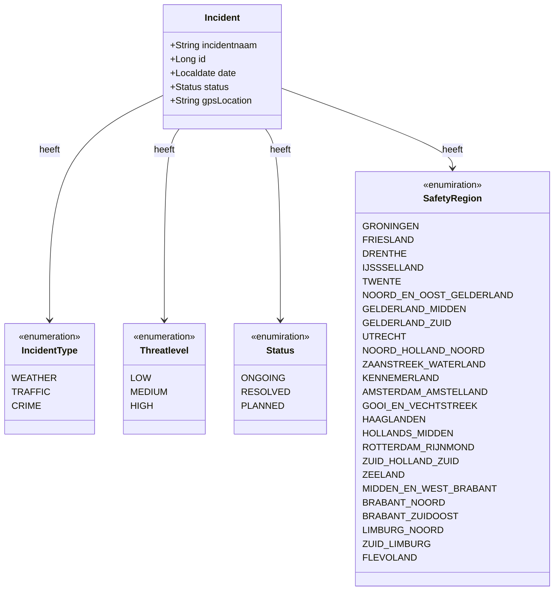

```mermaid
classDiagram
    class Incident {
        +String incidentnaam
        +Long id
        +Localdate date
        +Status status
        +String gpsLocation
    }

    class IncidentType {
        <<enumeration>> 
        WEATHER
        TRAFFIC
        CRIME
    }

    class Threatlevel {
        <<enumeration>>
        LOW
        MEDIUM
        HIGH
    }

    class Status {
        <<enumiration>>
        ONGOING
        RESOLVED
        PLANNED
    }

    class SafetyRegion {
        <<enumiration>>
        GRONINGEN
        FRIESLAND
        DRENTHE
        IJSSSELLAND
        TWENTE
        NOORD_EN_OOST_GELDERLAND
        GELDERLAND_MIDDEN
        GELDERLAND_ZUID
        UTRECHT
        NOORD_HOLLAND_NOORD
        ZAANSTREEK_WATERLAND
        KENNEMERLAND
        AMSTERDAM_AMSTELLAND
        GOOI_EN_VECHTSTREEK
        HAAGLANDEN
        HOLLANDS_MIDDEN
        ROTTERDAM_RIJNMOND
        ZUID_HOLLAND_ZUID
        ZEELAND
        MIDDEN_EN_WEST_BRABANT
        BRABANT_NOORD
        BRABANT_ZUIDOOST
        LIMBURG_NOORD
        ZUID_LIMBURG
        FLEVOLAND
    }

    Incident --> IncidentType : heeft
    Incident --> Threatlevel : heeft
    Incident --> Status : heeft
    Incident --> SafetyRegion : heeft
```