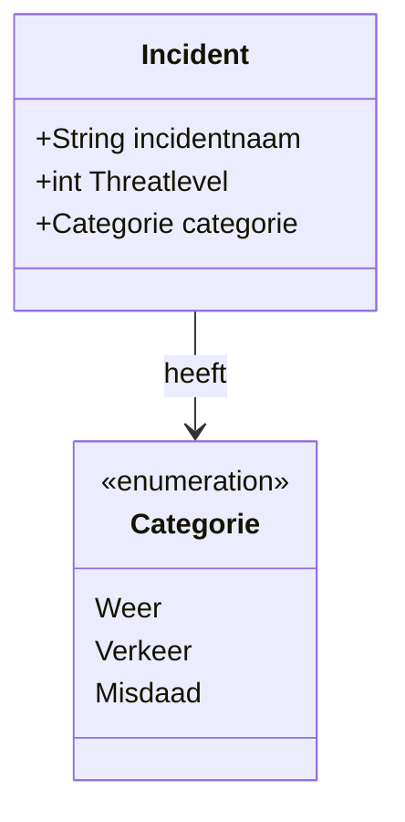

```mermaid
classDiagram
    class Incident {
        +String incidentnaam
        +int Threatlevel
        +Categorie categorie
    }

    class Categorie {
        <<enumeration>> 
        Weer
        Verkeer
        Misdaad
    }

    Incident --> Categorie : heeft
```